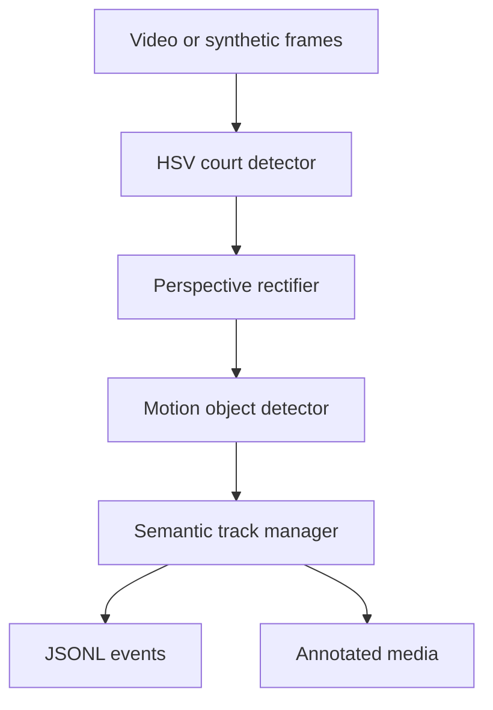

# Architecture

The repaired application separates frame I/O, computer vision, tracking, and
serialization. This makes each decision independently testable and lets a learned
detector replace the classical baseline without changing downstream consumers.

## Module map

| Module | Responsibility | Stateful? |
|---|---|---|
| `config.py` | Validate thresholds and load JSON configuration | No |
| `geometry.py` | Order corners and transform between coordinate spaces | No |
| `detection.py` | Detect the court and classify motion components | Yes |
| `tracking.py` | Assign semantic IDs and smooth court positions | Yes |
| `pipeline.py` | Orchestrate frames and write artifact bundles | Yes |
| `demo.py` | Generate a deterministic integration scene | No |
| `cli.py` | Parse commands and report actionable errors | No |

## Coordinate spaces

The application uses three explicit coordinate systems:

1. **Source pixels** are coordinates in the input frame. Court corners and
   `image_position` use this space.
2. **Canonical pixels** are coordinates in the rectified 600 x 360 court.
   `canonical_bbox` uses this space so thresholds are independent of input video
   resolution.
3. **Court coordinates** normalize the canonical court to `[0, 1] x [0, 1]`.
   `(0, 0)` is the top-left/far end and `(1, 1)` is the bottom-right/near end.

The court corner order is always top-left, top-right, bottom-right, bottom-left.

## Decision flow

### Court

1. Convert BGR to HSV.
2. Threshold using `court_lower_hsv` and `court_upper_hsv`.
3. Close small holes, open isolated noise, and choose the largest surface.
4. Reject it when its frame-area ratio is below `court_min_area_ratio`.
5. Approximate four corners and cache them for short detection gaps.

The emitted evidence includes the observed area ratio, solidity, minimum threshold,
and whether polygon approximation or a minimum-area rectangle produced the corners.

### Objects

OpenCV MOG2 produces a foreground mask in canonical court space. Each connected
component is evaluated against two transparent rule sets:

- a player is a sufficiently tall, upright motion component;
- a ball is a small, compact motion component with enough circularity.

Only candidates that satisfy every threshold become detections. Confidence is a
heuristic ranking score—not a calibrated probability.

### Identity

Players are assigned using court depth: the smallest normalized `y` becomes
`player_far` and the largest becomes `player_near`. The ball starts from the
highest-confidence candidate and subsequently uses nearest-position association.
Large jumps reset smoothing and are recorded in `tracking_status`.

## Extending the detector

To add a neural detector while retaining compatibility:

1. Implement a component that returns `list[Detection]` in canonical space.
2. Keep `label`, `confidence`, `canonical_bbox`, `court_position`, and `evidence`.
3. Replace `MotionObjectDetector` construction in `FrameProcessor` or inject it
   through a new factory.
4. Run the existing contract and pipeline tests.
5. Add a dataset card and evaluation protocol before reporting accuracy metrics.

## Failure behavior

- Missing or unreadable input returns CLI exit code `2` with a concise error.
- Invalid or misspelled configuration fails before processing.
- A temporarily missing court may use cached corners, marked `source: cached` and
  `visible: false`.
- A court missing beyond the cache limit emits an empty detection list.
- Video encoding is optional. JSONL, summary, and preview artifacts still work when
  `--no-video` is selected.
